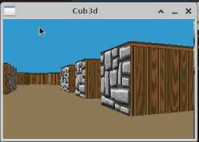

<h1 align="center">
	
 </h1>
 
 <div align="center">
 
  [](https://github.com/nandajfa/cub3D/blob/main/LICENSE)
  
 </div>
 
 ### 🗣️ About

> _This project is inspired by the world-famous Wolfenstein 3D game, which
was the first FPS ever. It will enable you to explore ray-casting. Make a dynamic view inside a maze, in which you’ll have to find your way._

#### 

* As a graphic design project, cub3D will enable you to improve your skills in these
areas: windows, colors, events, fill shapes, etc.
* Remarkable playground to explore the playful practical applications of mathematics without having to understand the specifics.
* With the help of the numerous documents available on the internet, use
mathematics as a tool to create elegant and efficient algorithms.

---

### Index

You're sections headers will be used to reference location of destination.

- [Examples :twisted_rightwards_arrows:](#examples)
- [Allowed Functions :white_check_mark:](#allowed-functions)
- [How To Use 📦](#how-to-use)
- [References 📌](#references)
- [Skills 📄](#skills)
- [Author Info  ✒️](#author)

### Examples

<div align="center">


</div>


## Allowed Functions

- **open** | **close** | **read** | **write** | **printf** | **malloc** | **free** | **perror** | **strerror** | **exit**
- [All functions of  the math library (-lm man man 3 math)](https://www.w3schools.com/c/c_math.php)
- [All functions of the MinilibX](https://github.com/42Paris/minilibx-linux)
  

<div align="right">
  <b><a href="#index">↥ back to top</a></b>
</div>
</br>

## How To Use
> Follow the steps below
```shell

# Clone the repository
git clone https://github.com/nandajfa/cub3D.git

# Access the folder
cd cub3D

# Run make to compile the program
make

# Run the program
./cub3d <.cub file>

# Clean output files with
make fclean

# Finish
```

## Game controls


## References

 * [Getting started - Minilibx](https://harm-smits.github.io/42docs/libs/minilibx/getting_started.html)
 * [Make Your Own Raycaster](https://www.youtube.com/watch?v=gYRrGTC7GtA)
 * [Raycasting](https://harm-smits.github.io/42docs/projects/cub3d)
 * [Raycasting in Scratch](https://www.youtube.com/watch?v=M1c5TcdITVs&ab_channel=griffpatch)
 * [Notion](https://www.notion.so/Cub3D-12ea8111ceef4007a7bd25ed46878a04)
 

## Skills

* Graphics
* Imperative programming
* Rigor
* Algorithms & AI


  ## Authors
 

 
 | [<br><sub>Jessica Fernanda</sub>](https://github.com/nandajfa) |  [<br><sub>Emerson Santana</sub>](https://github.com/D4rkSantana) |  
| :---: | :---: | 
 
 
 
 [](https://www.linkedin.com/in/jessica-fernanda-106651205) 
[](mailto:nanda.jfa@gmail.com)


</div>
<div align="right">
  <b><a href="#index">↥ back to top</a></b>
</div>
</br>
